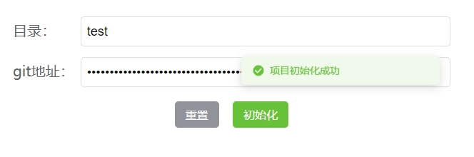
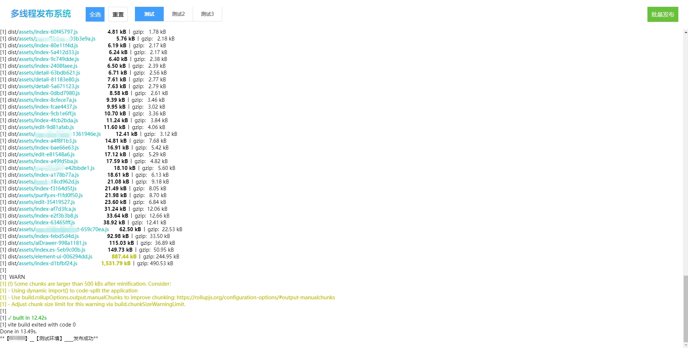

# 前言
由于公司的业务，需要将多个项目分批部署到不同的平台，那么针对这些平台的项目，每次发布到服务器，随着平台数量的增加，后期就会产生发错版本的问题，而且每次都是重复发布，此时就产生了一个想法：利用node.js的**多线程**机制**批量发布**项目。

同时支持**快速部署**一个新项目。

## 运行脚本
```
git clone https://github.com/wayung/build-system.git

cd build-system

npm install 或 yarn(推荐)

node index.js
```

## 配置项目
- 使用浏览器访问：localhost/init.html

- 填写目录和git地址
- 等待安装依赖

- 项目初始化成功后，会在根目录生成一个项目

## 部署
* 打开 build.html 文件，找到 header 里面的 span 标签，将 name 替换成上面设置的目录
* 打开 work.js 文件，分别更改 BASE_OBJ 和 PROJECT_OBJ 两处的配置文件，PROJECT_OBJ的键名既是上面设置的目录
* 使用浏览器访问：localhost，选择对应的项目，点击批量发布


## 补充
全文搜索：`192.168.1.207` 替换成自己电脑的ip地址